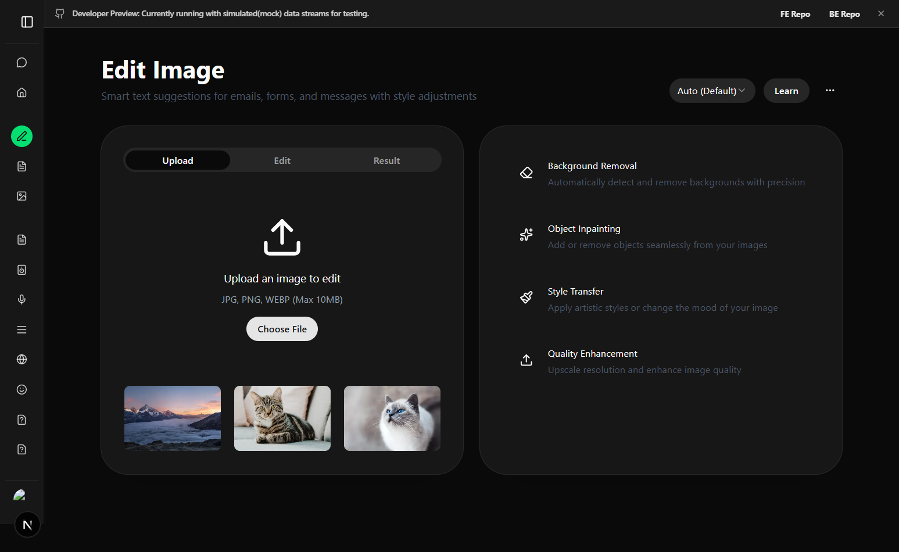
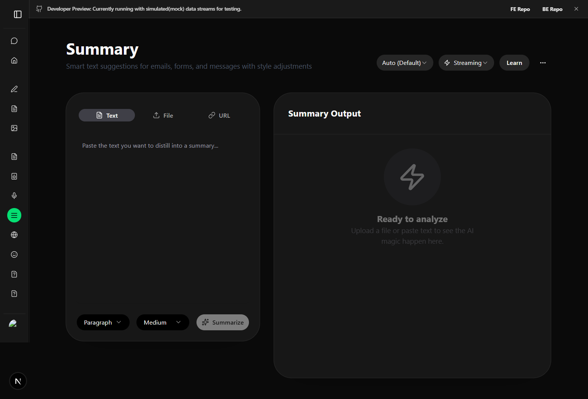
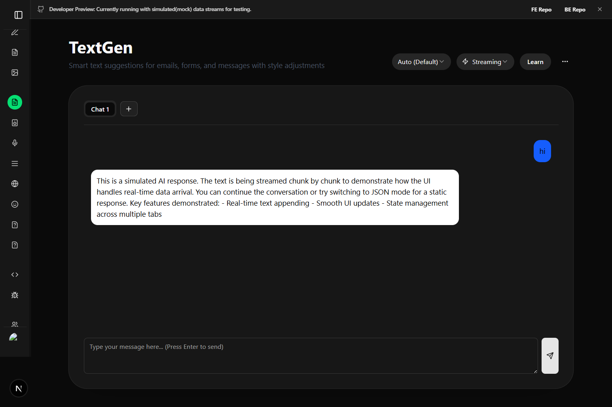
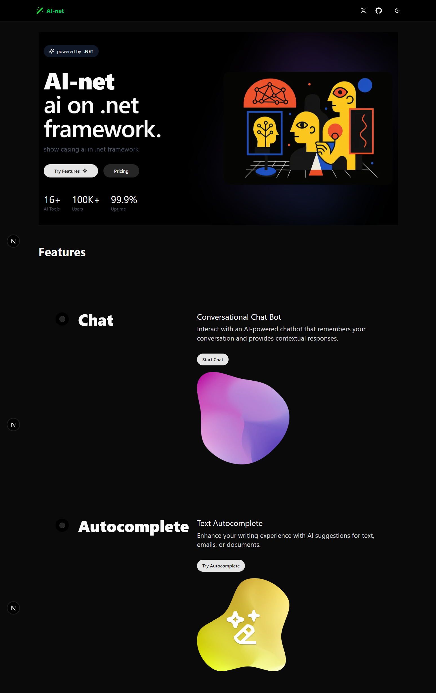

<p align="center">
  
</p>

# AI-Net Platform

<p align="center">
  
</p>
AI-Net is a platform designed to showcase powerful AI features powered by the [.NET Framework](https://dotnet.microsoft.com/) and [Microsoft Extensions AI](https://learn.microsoft.com/en-us/dotnet/core/extensions/ai).

This repository contains the client-side code, built using modern web development tools:

- **[Turborepo](https://turbo.build/repo)** for high-performance monorepo management
- **[Next.js](https://nextjs.org/)** for fast, React-based web applications
- **[TypeScript](https://www.typescriptlang.org/)** for robust, statically typed code
- **[Tailwind CSS](https://tailwindcss.com/)** for rapid UI styling

## Platform Features

The AI-Net platform includes the following demonstration modules:

- **[Code Generation](/code-gen)**: Generate programming code directly from natural language prompts.
- **[Meeting Assistant](/meeting)**: Analyze and summarize meeting transcripts or auto-generate action points.
- **[Learning Hub](/learning)**: AI-driven educational and conversational flows to assist with studying.
- **[Speech to Text](/speech-to-text)**: High-accuracy real-time text transcription and analytics from audio.
- **[Text Generation](/text-gen)**: Compose emails, essays, and general-purpose written content via AI.

## Repository Structure

```text
├── apps/
│   ├── web/         # The main portal app to try out AI features (Port 3000)
│   └── marketing/   # The promotional & marketing landing site (Port 3001)
├── packages/
│   ├── ui/          # Shared layout and UI components
│   ├── lib/         # Shared internal utility functions
│   ├── hooks/       # Custom React hooks used across applications
│   ├── types/       # Global TypeScript declarations and schemas
│   ├── eslint-config/   # Shared linting configuration
│   └── typescript-config/ # Base tsconfig configuration
```

## 📸 Screenshots

<p align="center">
  
  
</p>

<p align="center">
  
  
</p>

## Getting Started

1. **Install Dependencies:**
   Ensure you have Node.js and npm installed, then run:

   ```bash
   npm install
   ```

2. **Launch Development Servers:**
   Start all connected applications concurrently using Turborepo:
   ```bash
   npm run dev
   ```
   Navigate to `http://localhost:3000` to interact with the main web portal, and `http://localhost:3001` for the marketing site.

## Backend Repository

The APIs powering this client application are housed in our dedicated backend repository.
_(Please add the backend GitHub repository link here)_

## More About AI-Net

AI-Net represents a robust integration of Microsoft’s experimental Extensions AI features into a seamless, user-friendly frontend architecture. The goal is to provide developers and users a hands-on experience of .NET's emerging AI capabilities in a modern React/Next.js ecosystem.
